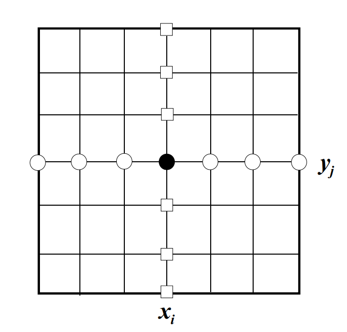
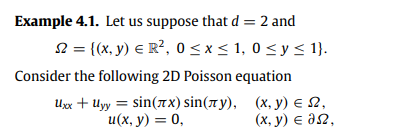
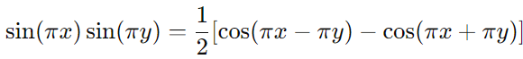
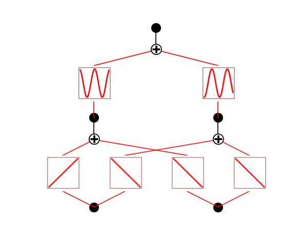

# MSC_VARUN
---

:warning: **Warning:** This project is currently under development. Additional information and updates will be added continuously. Stay tuned!

---
### Literature and Code for Varun's Master Thesis Project

Welcome to the repository for Varun's Master Thesis. This repository contains important literature and code related to Varun's research on solving Partial Differential Equations (PDEs) with a focus on B-splines. The purpose of this work is to compare his findings with the results of Isabella's network.

## Contents

- **Literature**: The `literature` folder contains various resources, papers, and notes that focus on Differential Quadrature and related numerical methods used throughout the project. This collection was essential in developing the code and understanding the methodologies.

- **Code**: The code in this repository is developed based on the literature reviewed. However, these are  just very simple examples i added.
The DQ -code was inspired by the paper [*Solving 2D-Poisson equation using modified cubic B-spline differential quadrature method*](https://www.sciencedirect.com/science/article/pii/S2090447917301521). Additionally, I added finite difference methods.
Both these cases solves the potential for an example source term `sin(pi * x) * sin(pi * y)` and compares the numerical solution with the exact solution. The results of these comparisons can be seen in the figures below.


## Background about the method


**Figure 3: Comparison between Library SciPy and Manual implementation (code/B_splines/comparison_lib_man.py)**




### DQ- method and comparison finite difference

## Finite difference
1D Boundary Value Problem: Dirichlet Boundary Conditions

Consider solving the 1D Poisson’s equation with homogeneous Dirichlet boundary conditions:

```math
\begin{aligned}
-u''(x) &= f(x), \quad x \in (0, 1), \\
u(0) &= 0, \quad u(1) = 0.
\end{aligned}
```

After approximating  $`d^2/dx^2`$ by the finite difference operator $`D^2`$, we obtain the finite difference scheme:

```math
-D^2 u_j = \frac{-u_{j-1} + 2u_j - u_{j+1}}{h^2} = f_j,  j = 1, 2, \dots, n.
```

## DQ- method
As shown in above Figure, the DQ approximates the derivative
of a function with respect to `x` at a mesh point $`x_i, y_j`$ (represented by the dark circle) by
all the functional values along the mesh line of $`y = y_j`$  (represented by the white circle),
and the derivative of the function with respect to `y` by all the functional values along the
mesh line of  $`x = x_i`$ (represented by the white square).
That is, by the differential quadrature method, we approximate the spatial derivatives of unknown function at any grid points using weighted sum of all the functional values at certain points in the whole computational domain.

Mathematically, the DQ approximation of the $`n`$-th order derivative with respect to $`x`$, $`f_x^{(n)}`$, and the $`m`$-th order derivative with respect to $`y`$, $`f_y^{(m)}`$, at $`(x_i, y_j)`$ can be written as:

$`f_x^{(n)}(x_i, y_j) = \sum_{k=1}^{N} w_i^{(n)}(x_k, y_j) f(x_k, y_j)`$  
$`f_y^{(m)}(x_i, y_j) = \sum_{k=1}^{M} w_j^{(m)}(x_i, y_k) f(x_i, y_k)`$  

where $`N`$ and $`M`$ are, respectively, the number of mesh points in the $`x`$ and $`y`$ directions, $`w_i^{(n)}`$ and $`w_j^{(m)}`$ are the DQ weighting coefficients in the $`x`$ and $`y`$ directions.
For second derivative n = m = 2 we combine the derivative matrices in both directions using the Kronecker product to form the Laplacian matrix:

```math
\nabla^2 = I_y \otimes f_x^2 + f_y^2 \otimes I_x
 ```
where \(I\) is the identity matrix and $`\otimes`$  denotes the Kronecker product.

### Imposing Boundary Conditions

To enforce Dirichlet boundary conditions (i.e., \(u = 0\) on the boundary), we modify the Laplacian matrix and the source term \(f(x, y)\). Specifically, we set the rows of the Laplacian matrix corresponding to boundary points to enforce the boundary condition:

```math
\nabla^2 [i, :] = 0 \quad \text{for all boundary indices} \, i
 ```
```math
\nabla^2 [i, i] = 1
 ```
```math
f[i] = 0
 ```

This ensures that the solution $`u(x, y)`$ is zero at the boundary points.

### Solving the System of Equations

Once the Laplacian matrix is constructed and the boundary conditions are applied, we solve the system of linear equations:

```math
\nabla^2\cdot U = f
 ```

where $`U`$ is the vector of unknowns (the values of $`u(x, y)`$ at the grid points), and $`f`$  is the source term of the PDE.

The system is solved using standard linear algebra techniques, such as LU decomposition or sparse solvers, since the Laplacian matrix is often sparse.


**Differential Quadrature (DQ) method** has a global nature, which allows it to approximate derivatives using all available data points, unlike local methods such as finite difference or finite element methods. 

### 1. Global Nature of DQ Method:
- **Global Method**: The DQ method is global because, for the approximation of a derivative at any given point, it uses the functional values at **all mesh points** in the domain, rather than just the values at nearby or adjacent points (which is common in local methods like finite difference).
- In the DQ method, each point is influenced by every other point in the mesh. This means that **every point in the grid** is involved in every derivative calculation, which can lead to very accurate solutions, even with fewer grid points, because the global influence provides a more comprehensive approximation.

### 2. Comparison Between DQ and Finite Difference (FD) Methods:
- **Derivative Approximation**:
  - **DQ**: Approximates the derivative using the **entire set of functional values** across all mesh points.
  - **FD**: Approximates the derivative locally, using a **small stencil** (e.g., 2 or 3 neighboring points) to estimate the derivative at a point.
  
- **Accuracy**:
  - **DQ**: Provides **high-order accuracy** due to the use of global information, which means that fewer points can produce accurate results.
  - **FD**: The accuracy depends on the **order of the stencil** used (e.g., a 2-point stencil gives second-order accuracy). To achieve higher accuracy, the method requires **more mesh points** or higher-order stencils.
  
- **Mesh Requirements**:
  - **DQ**: Since DQ uses global information, it can achieve high accuracy with **fewer mesh points**. This is particularly useful for problems where generating fine meshes is costly or impractical.
  - **FD**: Typically requires **finer meshes** (more mesh points) to achieve the same level of accuracy as DQ, especially for smooth solutions over large domains.

- **Computational Complexity**:
  - **DQ**: Due to the global nature of DQ, the resulting system of equations can become **dense**, which increases the computational cost, especially for large domains. However, fewer mesh points are needed, which partially compensates for this.
  - **FD**: The system of equations in FD is **sparse** (because each point only interacts with its neighbors), making it computationally efficient for large-scale problems with many mesh points.

### Summary of Key Differences:

| Feature              | Differential Quadrature (DQ)                    | Finite Difference (FD)                     |
|----------------------|-------------------------------------------------|--------------------------------------------|
| **Derivative Approx.**| Global (all mesh points)                       | Local (small stencil)                      |
| **Accuracy**          | High-order, fewer mesh points required         | Lower-order, more mesh points needed       |
| **Mesh Size**         | Coarser mesh can yield accurate results        | Requires finer mesh for similar accuracy   |
| **Computational Cost**| Higher due to dense systems                    | Lower due to sparse systems                |
| **Best for**          | Smooth problems requiring global accuracy      | Problems with sharp gradients or complex geometries |


### DQ-Spline method and comparison finite element

As shown by Shu (2000), $`w_i^{(n)}`$ depends on the approximation of the one-dimensional function $`f(x_j, y)`$ (with $`x`$ as the variable), while $`w_j^{(m)}`$ depends on the approximation of the one-dimensional function $`f(x, y_i)`$ (with $`y`$ as the variable).

When $`f(x_j, y)`$ or $`f(x, y_i)`$ is approximated by a high-order polynomial, Shu and Richards (1992) derived a simple algebraic formulation and a recurrence relationship to compute $`w_i^{(n)}`$ and $`w_j^{(m)}`$. 
When the function is approximated by a Fourier series expansion, Shu and Chew (1997) also derived simple algebraic formulations to compute the weighting coefficients of the first and second-order derivatives.


The basic idea behind the **Differential Quadrature (DQ) method** is that any derivative can be approximated by a **linear weighted sum of functional values** at selected mesh points. When using **B-splines** for DQ, we retain this concept but modify the choice of functional values by leveraging the **local support** property of B-splines. In contrast to the conventional DQ approximation, which involves all mesh points in the domain, the B-spline DQ method only uses **neighboring points** affected by the B-spline basis functions. This ensures a more localized influence on the derivative computation.


This relationship helps in indexing the mesh points more efficiently when constructing the differentiation matrices for B-splines.

### Derivative Approximation with B-Splines:

For B-splines, the approximation of the **m-th order derivative** with respect to `x` and the **n-th order derivative** with respect to `y` at a mesh point `(x_k, y_k)` is computed using the local support of the B-splines. 
Since B-splines only influence a small number of nearby points, the sum in the DQ approximation is restricted to the points within the **local support region**. The derivaties will have 0 value outside the neighboruing points. For a higher degree of the spline there will be more poitns that influence. 
So depending on the order of your splines you can choose how many bumber fo poitns that will be influenced. 

The **m-th order derivative** with respect to `x` using B-splines is approximated as:
> ```math
> f_x^{(m)}(x_k, y_k) = \sum_{i=1}^{M \times N} w_i^{(m)} f(x, y_i)
> ```
Similarly, the **n-th order derivative** with respect to `y` using B-splines is approximated as:

> ```math
> f_y^{(n)}(x_k, y_k) = \sum_{i=1}^{M \times N} w_i^{(n)} f(x_i, y)
> ```

Here, `M* N` represents the number of mesh points, but only a few wll be affected by the B-spline in both the `x` and `y` directions, respectively. These points are determined by the **degree of the B-spline**, which defines the width of the support region.
> ```math
> U_x(x_i) = \sum_{j=1}^{N} W_{i,j}^{(1)} U(x_j), \quad \text{for } i = 1, \dots, N
> ```

> ```math
> U_{xx}(x_i) = \sum_{j=1}^{N} W_{i,j}^{(2)} U(x_j), \quad \text{for } i = 1, \dots, N
> ```


where `W^(1)_i,j` and `W^(2)_i,j` are the weighting coefficients of the first and second-order partial derivatives, respectively.

In this project, we use the **modified cubic-B-spline method** along with **Shu's method** for obtaining the weighting coefficients. In particular, we define the B-spline basis functions `ψ_k(x_i)` and its derivatives in the following relation:
> ```math
> \psi'_k(x_i) = \sum_{j=1}^{N} W_{i,j}^{(1)} \psi_k(x_j), \quad \text{for } i = 1, 2, \dots, N; \, k = 1, 2, \dots, N
> ```

To get the weighting coefficients, we follow the DQ method for deriving the appropriate sparse matrices for second derivatives, ensuring a computationally efficient implementation.


In the matrix form, the weighting coefficient matrix of the x-derivative can then be determined by:

```math
[U_x][W^n]^T = f
```

where $`[W^n]^T`$ is the transpose of the weighting coefficient matrix $W^n$, and:

With the known matrices $[f]$ and $[U_x]$, the weighting coefficient matrix $[W^n]$ can be obtained by using a direct method like LU decomposition. 
The weighting coefficient matrix of the y-derivative can be obtained in a similar manner. 
Using these weighting coefficients, we can discretize the spatial derivatives and transform the governing equations into a system of algebraic equations, which can be solved by iterative or direct methods.


> ### Some info about the DQ code 
> 
> We consider the well-known two-dimensional Poisson equation:
> 
> ```math
> \frac{\partial^2 z}{\partial x^2} + \frac{\partial^2 z}{\partial y^2} = f(x, y) = sin(pi * x) * sin(pi * y), \quad x, y \in [a, b]
> ```
> 
> under Dirichlet and mixed boundary conditions. The Differential Quadrature (DQ) method approximates the spatial partial derivatives in the PDE by a sum of weights multiplied by the function values at discrete knots over the domain \([a, b]\). The first and second-> > > order partial derivatives with respect to \(x\) over domain \([a, b]\) are defined as:
> 
> ```math
> U_x(x_i) = \sum_{j=1}^{N} W^{(1)}_{i,j} U(x_j), \quad \text{for } i = 1, \ldots, N
> ```
> 
> 
> ```math
> U_{xx}(x_i) = \sum_{j=1}^{N} W^{(2)}_{i,j} U(x_j), \quad \text{for } i = 1, \ldots, N
> ```
> 
> where $`W^{(1)}_{i,j}`$ and $`W^{(2)}_{i,j}`$ are the weighting coefficients of the first and second-order partial derivatives, respectively. 
> In this project, we use the modified cubic-B-spline method along with Shu's method for obtaining the weighting coefficients.
> 
> 
> Especially we have the B-spline basis functions $`\psi_k(x_i)`$  and its derivatives in the following relaion:
> 
> ```math
> \psi'_k(x_i) = \sum_{j=1}^{N} W^{(1)}_{i,j} \psi_k(x_j) \quad \text{for } i = 1, 2, \ldots, N; \, k = 1, 2, \ldots, N
> ```
> 
> To get the weighting coefficients of the second-order derivatives:
> 
> ```math
> W^{(2)}_{i,j} = 2W^{(1)}_{i,j} \cdot W^{(1)}_{i,i} - \frac{1}{x_i - x_j}, \quad \text{for } i, j = 1, \ldots, N; i \neq j
> ```
> 
> and
> 
> ```math
> W^{(2)}_{i,i} = - \sum_{j=1, j \neq i}^{N} W^{(2)}_{i,j}
> ```
> 
> 
> The differential quadrature method is applied which leads to a set of DQ algebraic equations as follows:
> 
> ```math
> \sum_{k=1}^{N} W^{(2)}_{i,k} u_{k,j} + \sum_{k=1}^{M} W^{(2)}_{j,k} u_{i,k} = f(x, y)
> ```
> 
> which can be rewritten as:
> 
> ```math
> \sum_{k=2}^{N-1} W^{(2)}_{i,k} U_{k,j} + \sum_{k=2}^{M-1} W^{(2)}_{j,k} U_{i,k} = f(x_i, y_j) - W_{i,1} U_{1,j} - W_{i,N} u_{N,j} - W_{j,1} U_{i,1} - W_{j,M} U_{i,M}
> ```
> 
> And then solved for. 
> 
> **_NOTE:_** 
> - In the provided DQ code, the second derivatives are directly obtained from the B-splines. Although the method differs slightly from the above formulation, the underlying principles remain consistent, and the equations are used to solve for the potential.
> 
> - The code that demonstrates these methods will be added soon.


## Recommended Reading about PDEs

For a comprehensive summary of solving PDEs in the electrostatic case, I highly recommend the following resource:

- **[Numerical Integration of Partial Differential Equations: Stationary Problems, Elliptic PDE](https://www.mps.mpg.de/phd/numerical-integration-partial-differential-equations-stationary-problems-elliptic-pde)**  
  This material provides an excellent overview of different methods used to solve PDEs, especially in the context of electrostatics. It covers various numerical techniques and is a great starting point for understanding the theoretical background.
Additionally, this GitHub repository contains course materials for **Fast Methods for Partial Differential and Integral Equations**, which includes a wealth of information valuable to this project. Be sure to explore the "readings" folder for further insights.

- **[MIT 18.336 - Fast Methods for Partial Differential and Integral Equations](https://github.com/mitmath/18336/tree/master)**  
  This resource originally hosted course material that covered fast computational methods for solving PDEs and integral equations, including valuable insights on spectral methods and other efficient techniques.

## Recommended Reading on B-Splines

For a review of B-splines and their properties, I recommend the materials provided by the University of Oslo. The following chapters were particularly useful:

- **[Chapter 1: Introduction to B-Splines](https://www.uio.no/studier/emner/matnat/ifi/nedlagte-emner/INF-MAT5340/v07/undervisningsmateriale/kap1.pdf)**: This chapter provides a foundational understanding of B-splines, including basic definitions and concepts.
- **[Chapter 3: Properties of B-Splines](https://www.uio.no/studier/emner/matnat/ifi/nedlagte-emner/INF-MAT5340/v07/undervisningsmateriale/kap3.pdf)**: This chapter covers the detailed properties of B-splines, which were extensively used in this project.

These resources offer comprehensive insights into B-splines, which were necessary in the development and understanding of the code in this repository.


## Additional Numerical Methods for PDE-Solving

For further exploration of numerical methods that can be discussed in the thesis, I introduce some documents here:

- **[Implementing FFTs in Practice](https://www.csd.uwo.ca/~mmorenom/CS433-CS9624/Resources/Implementing_FFTs_in_Practice.pdf)**: This document offers valuable insights into the practical aspects of FFTs.


### Results

Below are the results comparing the numerical solution with the exact solution:

**Figure 1: Using B-Spline DQM (code/DQM/using_B_splines.py)**


**Figure 2: Using Finite-Differences (code/finite_differences/simple_solution.py)**


**Figure 3: Comparison between Library SciPy and Manual implementation (code/B_splines/comparison_lib_man.py)**


By solving, for example the following problem using DQ-Spline method


We can compare it with the solution that KAN-neural network learns. 
Knowing the solution of the function, we can also fix the activation functions.


Here is the structure


| Input (x, y)            | Prediction   | Actual      | Difference    |
|-------------------------|--------------|-------------|---------------|
| (0.5, 0.5)              | 0.999616     | 1.0         | -0.000383     |
| (0.3, 0.7)              | 0.654078     | 0.654508    | -0.000430     |
| (0.1, 0.9)              | 0.095303     | 0.095492    | -0.000188     |
| **MSE**                 |              |             |  1.227723e-07 |


