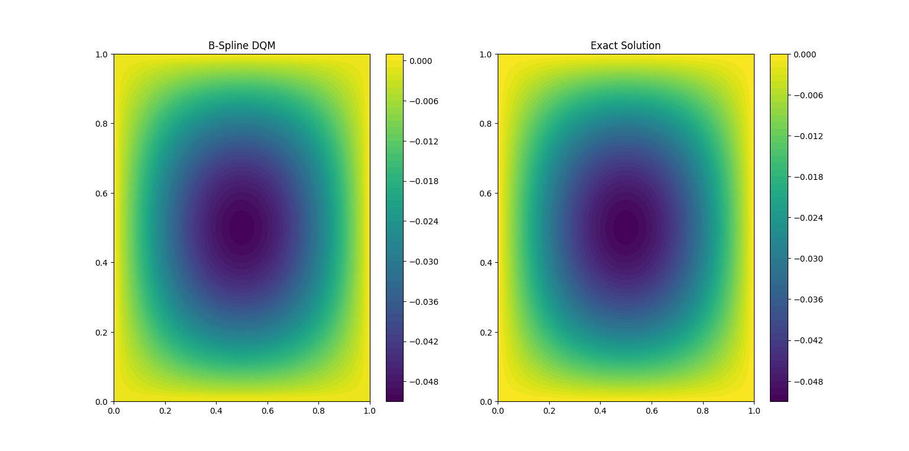
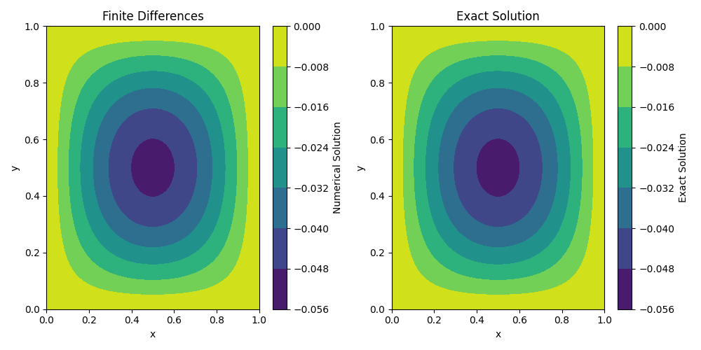
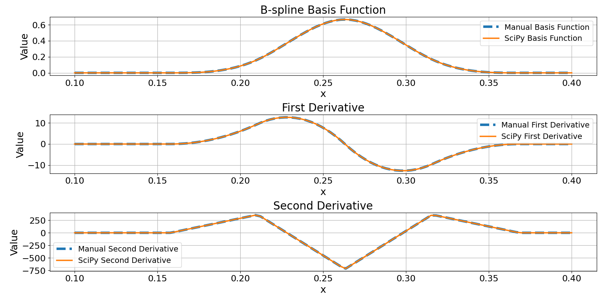

# MSC_VARUN
---

:warning: **Warning:** This project is currently under development. Additional information and updates will be added continuously. Stay tuned!

---
### Literature and Code for Varun's Master Thesis Project

Welcome to the repository for Varun's Master Thesis. This repository contains important literature and code related to Varun's research on solving Partial Differential Equations (PDEs) with a focus on B-splines. The purpose of this work is to compare his findings with the results of Isabella's network.

## Contents

- **Literature**: The `literature` folder contains various resources, papers, and notes that focus on Differential Quadrature and related numerical methods used throughout the project. This collection was essential in developing the code and understanding the methodologies.

- **Code**: The code in this repository is developed based on the literature reviewed. However, these are  just very simple examples i added.
The DQ -code was inspired by the paper [*Solving 2D-Poisson equation using modified cubic B-spline differential quadrature method*](https://www.sciencedirect.com/science/article/pii/S2090447917301521). Additionally, I added finite difference methods.
Both these cases solves the potential for an example source term `sin(pi * x) * sin(pi * y)` and compares the numerical solution with the exact solution. The results of these comparisons can be seen in the figures below.

## Recommended Reading about PDEs

For a comprehensive summary of solving PDEs in the electrostatic case, I highly recommend the following resource:

- **[Numerical Integration of Partial Differential Equations: Stationary Problems, Elliptic PDE](https://www.mps.mpg.de/phd/numerical-integration-partial-differential-equations-stationary-problems-elliptic-pde)**  
  This material provides an excellent overview of different methods used to solve PDEs, especially in the context of electrostatics. It covers various numerical techniques and is a great starting point for understanding the theoretical background.
Additionally, this GitHub repository contains course materials for **Fast Methods for Partial Differential and Integral Equations**, which includes a wealth of information valuable to this project. Be sure to explore the "readings" folder for further insights.

- **[MIT 18.336 - Fast Methods for Partial Differential and Integral Equations](https://github.com/mitmath/18336/tree/master)**  
  This resource originally hosted course material that covered fast computational methods for solving PDEs and integral equations, including valuable insights on spectral methods and other efficient techniques.

## Recommended Reading on B-Splines

For a review of B-splines and their properties, I recommend the materials provided by the University of Oslo. The following chapters were particularly useful:

- **[Chapter 1: Introduction to B-Splines](https://www.uio.no/studier/emner/matnat/ifi/nedlagte-emner/INF-MAT5340/v07/undervisningsmateriale/kap1.pdf)**: This chapter provides a foundational understanding of B-splines, including basic definitions and concepts.
- **[Chapter 3: Properties of B-Splines](https://www.uio.no/studier/emner/matnat/ifi/nedlagte-emner/INF-MAT5340/v07/undervisningsmateriale/kap3.pdf)**: This chapter covers the detailed properties of B-splines, which were extensively used in this project.

These resources offer comprehensive insights into B-splines, which were necessary in the development and understanding of the code in this repository.


## Additional Numerical Methods for PDE-Solving

For further exploration of numerical methods that can be discussed in the thesis, I introduce some documents here:

- **[Implementing FFTs in Practice](https://www.csd.uwo.ca/~mmorenom/CS433-CS9624/Resources/Implementing_FFTs_in_Practice.pdf)**: This document offers valuable insights into the practical aspects of FFTs.


### Results

Below are the results comparing the numerical solution with the exact solution:

**Figure 1: Using B-Spline DQM (code/DQM/using_B_splines.py)**



**Figure 2: Using Finite-Differences (code/finite_differences/simple_solution.py)**



**Figure 3: Comparison between Library SciPy and Manual implementation (code/B_splines/comparison_lib_man.py)**



## DQD-Splines

### Methods Description

We consider the well-known two-dimensional Poisson equation:

```math
\frac{\partial^2 z}{\partial x^2} + \frac{\partial^2 z}{\partial y^2} = f(x, y), \quad x, y \in [a, b]
```

under Dirichlet and mixed boundary conditions. The Differential Quadrature (DQ) method approximates the spatial partial derivatives in the PDE by a sum of weights multiplied by the function values at discrete knots over the domain \([a, b]\). The first and second-order partial derivatives with respect to \(x\) over domain \([a, b]\) are defined as:

\[
U_x(x_i) = \sum_{j=1}^{N} W^{(1)}_{i,j} U(x_j), \quad \text{for } i = 1, \ldots, N
\]

\[
U_{xx}(x_i) = \sum_{j=1}^{N} W^{(2)}_{i,j} U(x_j), \quad \text{for } i = 1, \ldots, N
\]

where \(W^{(1)}_{i,j}\) and \(W^{(2)}_{i,j}\) are the weighting coefficients of the first and second-order partial derivatives, respectively. The weighting coefficients for \(N\) discrete knots \((x_1, x_2, \ldots, x_N)\) can be calculated using different methods. In this project, we use the modified cubic-B-spline method along with Shu's method for obtaining the weighting coefficients.

#### Modified Cubic B-Spline Differential Quadrature Method

In spline-based differential quadrature, we use uniform discretization: \(x_1 < x_2 < \ldots < x_n\) such that \(x_{i+1} - x_i = h\). The basis functions of the Cubic B-Spline DQ are:

\[
W_j(x) = 
\begin{cases} 
\frac{1}{h^3} (x - x_{j-2})^3, & x \in (x_{j-2}, x_{j-1}) \\
\frac{1}{h^3} (x - x_{j-2})^3 - 4 (x - x_{j-1})^3, & x \in (x_{j-1}, x_j) \\
\frac{1}{h^3} (x_{j+2} - x)^3 - 4 (x_{j+1} - x)^3, & x \in (x_j, x_{j+1}) \\
\frac{1}{h^3} (x_{j+2} - x)^3, & x \in (x_{j+1}, x_{j+2}) \\
0, & \text{Otherwise}
\end{cases}
\]

where \(\{W_0, W_1, \ldots, W_{N+1}\}\) are the basis on the region \([a,b]\). Modifications to the cubic B-spline basis functions for problems with Dirichlet boundary conditions can result in a diagonally dominant system of equations, as proposed by Mittal and Jain. The modified basis functions are:

\[
\begin{aligned}
w_1(x) &= W_1(x) + 2W_0(x), \\
w_2(x) &= W_2(x) - W_0(x), \\
w_j(x) &= W_j(x) \quad \text{for } j = 3, \ldots, N-2, \\
w_{N-1}(x) &= W_{N-1}(x) - W_{N+1}(x), \\
w_N(x) &= W_N(x) + 2W_{N+1}(x).
\end{aligned}
\]

The derivatives of the modified basis functions are used to compute the weighting coefficients. The weighting coefficients for the first derivatives are calculated using the following system:

\[
\begin{bmatrix}
6 & 1 & & & & & \\
1 & 4 & \ldots & & & & \\
& \ldots & & & 1 & 4 & 1 \\
& & & & 1 & 6
\end{bmatrix}
\begin{bmatrix}
W^{(1)}_{i,1} \\
W^{(1)}_{i,2} \\
W^{(1)}_{i,3} \\
\vdots \\
W^{(1)}_{i,N}
\end{bmatrix}
=
\begin{bmatrix}
w'_1(x_i) \\
w'_2(x_i) \\
w'_3(x_i) \\
\vdots \\
w'_N(x_i)
\end{bmatrix}
\]

To get the weighting coefficients of the second-order derivatives:

\[
W^{(2)}_{i,j} = 2W^{(1)}_{i,j} \cdot W^{(1)}_{i,i} - \frac{1}{x_i - x_j}, \quad \text{for } i, j = 1, \ldots, N; i \neq j
\]

and

\[
W^{(2)}_{i,i} = - \sum_{j=1, j \neq i}^{N} W^{(2)}_{i,j}
\]

This approach provides a robust way to compute accurate weighting coefficients for solving PDEs using modified spline-based differential quadrature methods.

